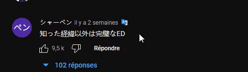
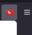
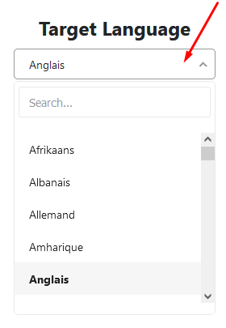

<h1 align="center">YouTube-Comment-Translate (Firefox)</h1>

	  
		<a href="https://addons.mozilla.org">
			
	  

<!-- vim-markdown-toc GFM -->

- [Usage](#usage)
  - [Changing the language](#changing-the-language)
- [Installation](#installation)

<!-- vim-markdown-toc -->

## Usage

After installing, this icon will appear next to every comment 

### Changing the language

The default target language is your browser language. To change it, click in the top right corner of firefox on the extension icon:

and select a new target language by clicking on the dropdown:

The changes are applied instantly so no need to refresh the youtube page

## Installation

simply download the extension from https://addons.mozilla.org

The icons used in the README are from the open-source [papirus-icon-theme](https://github.com/PapirusDevelopmentTeam/papirus-icon-theme) project
